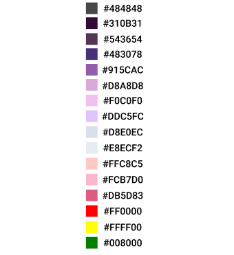
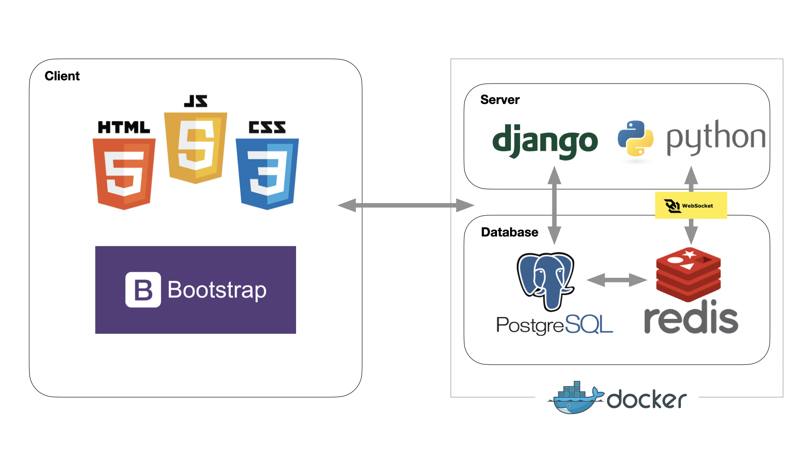
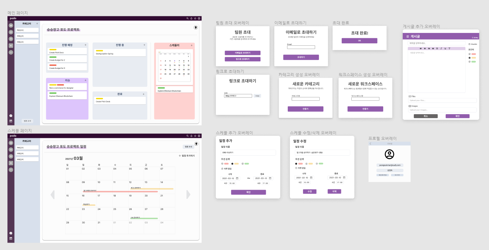

# PODO 🍇 
주니어 개발자들을 위한 협업툴 `PODO`!  
생애 첫 개발 프로젝트를 포도와 함께 하세요 😉

  

## 🙋‍♂️ 프로젝트 소개 🙋‍♀️

>초등학교 첫 여름방학, 포도가 그려진 종이 한 장에 한 알 한 알 스티커를 붙이며 설레는 마음으로 숙제를 제출하던 그 순간을 떠올렸습니다.
>이제는 혼자가 아닌 주니어 개발자들이 열매를 한 알 한 알 맺을 수 있도록 돕는 프로젝트 협업툴입니다.  

## 😸 Member

<table>
  <tr>
    <td align="center"><a href="https://github.com/woosteelz"> <b>WOOCHEOL</b></a> </td>
    <td align="center"><a href="https://github.com/yeongsummer"> <b>YEONGHA</b></a> </td>
    <td align="center"><a href="https://github.com/DongKyunJung"> <b>DONGKYUN</b></a> </td>
    <td align="center"><a href="https://github.com/khyunchoi"> <b>GANGHYEON</b></a> </td>
    <td align="center"><a href="https://github.com/hongjungkimm"> <b>HONGJUNG</b></a> </td>
  </tr>
</table>  
  
  
## 👨🏻‍🤝‍👨🏻 역할

- **정우철** (팀장)  : 채팅 기능 구현
- **장영하** (부팀장)  : 일정 & 검색 기능 구현
- **정동균** (UI 디자인 총괄)  : 워크스페이스 & 카테고리 기능 구현
- **최강현** (기술 고문) : 소셜 로그인 & 사용자 인증 기능 구현
- **김홍중** (PM) : 칸반 보드 & 게시글 기능 구현  

## 📌 개발 가이드라인

- 정기 및 상시 회의를 통해 프로젝트의 완성도를 높입니다.
- 개발 일정을 준수하며, 이슈가 있을 시에는 즉각 공유하여 신속하게 해결합니다.

- 상세한 주석을 통해 코드의 이해도를 높입니다.
- 정해진 Git branch 전략을 통해 협업의 일관성을 유지합니다.  

## 🎨 스타일 가이드라인

- `podo`는 사용자가 보고 느끼는 경험을 최우선으로 합니다.

- 클래스 지정은 App 이름을 포함하여 충돌을 방지합니다.

- 길이, 높이, 테두리 등 세부사항은 사전에 만든 UI 프로토 타입을 기준으로 지정합니다.

- 색은 사전에 만든 컬러 팔레트를 기준으로 지정합니다.

- **Color Palette**

  

## 💻 Tech Stack

  

## 💡 주요 기능 목록

- 네이버, 카카오, 구글, 깃헙 계정과 연동한 소셜 로그인 기능
- 이메일 인증을 통한 비밀번호 찾기 기능
- 비회원 초대 이메일 발송 기능
- 워크스페이스별 단체 채팅 기능
- 드래그 앤 드롭 칸반 보드 기능
- Summernote 라이브러리 기반 텍스트 편집 기능
- Calendar 라이브러리 HTML Calendar 기반 일정 기능  

## 📐 UI & ERD

- **ERD** **(Erdcloud)**

  

- **UI** **(Figma)**

  

## 😘 프로젝트 마무리 소감

- **정우철** : 
- **장영하** :
- **정동균** :
- **최강현** :
- **김홍중** :
